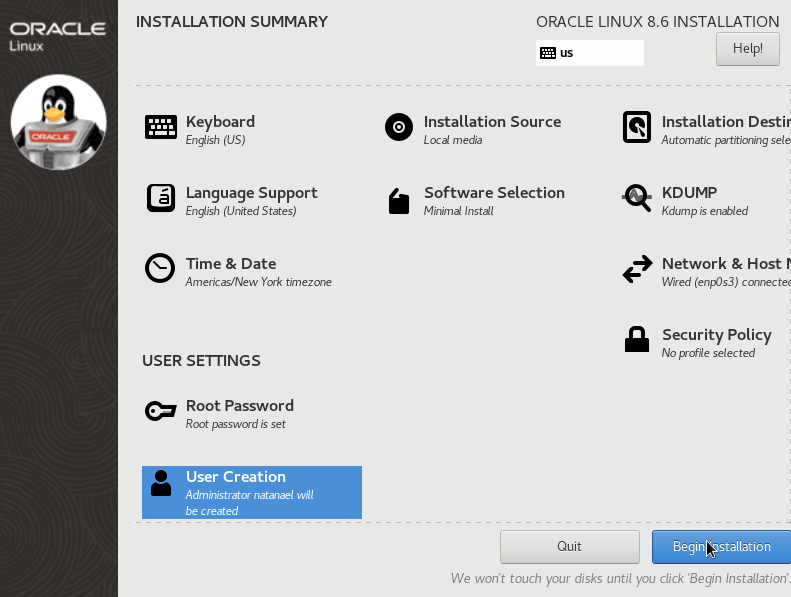

# Oracle Linux

Esta documentação tem por objetivo principal apresentar as etapas de ambientação virtual e instalação do SO.

### Pré requisitos

- Possuir o [Oracle VM VirtualBox](https://www.virtualbox.org/wiki/Downloads) instalado em sua máquina.

- Realizar o download da imagem ISO referente ao sistema operacional desejado. Foi utilizado o [Oracle Linux](https://yum.oracle.com/oracle-linux-isos.html) (release 8.6, Full ISO).

### Preparação da VM

Este tópico apresenta as etapas relacionadas a criação da VM. Para melhor entendimento, as mesmas foram descritas em sequência.

1. Nome e SO: deve-se atribuir um nome para identificação da VM; Localizar a pasta onde constará os arquivos da máquina; e selecionar o tipo e versão do SO. Foram atribuídos o tipo **Linux** e a versão **Oracle (64-bit)**.

2. Tamanho da memória: selecionar a quantidade de memória RAM que será disponibilizada a VM. Verifique a quantidade sugerida. Para a VM, foi disponibilizado **1024 MB de RAM** (caso queira, poderá alterar posteriormente).

3. Disco rígido e seu tipo de arquivos: manter a opção selecionada de **criar um disco rígido virtual agora** e, em seguida, alterar a opção para **VHD**.

4. Armazenamento em disco rígido físico: preservar a opção **dinamicamente alocada**.

5. Tamanho do arquivo: disponibilizar o tamanho da imagem de disco virtual. A VM em questão tem disponível **50 GB**.

Após a criação da VM, foram alteradas algumas configurações com foco no melhor desempenho, sendo elas:  
Ceder dois núcleos de processamento.
```
configurações → sistema → processador
```
Selecionar a imagem ISO.
```
configurações → armazenamento → controladora: IDE → arquivo ISO
```
Desabilitar áudio.
```
configurações → áudio
```
Placa em modo Bridge.
```
configurações → rede → selecionar opção Bridge
```

### Instalação do SO

Este tópico descreve as etapas de instalação do SO, as quais devem ser seguidas rigorosamente conforme consta abaixo.

1. Iniciar a VM.
 
 	A VM apresenta uma tela para que seja possível darmos seguimento nas etapas de configuração.

2. Selecionar linguagem.

	Foi selecionado a linguagem padrão (english).

3. Sumário de instalação  
  

- *Software Selection*: foi selecionado a opção *minimal install* para que seja instalado o SO sem interface gráfica.
- *Installation Destination*: selecionar o disco criado anteriormente (50 GB).
- *Network*: ativar a opção ethernet (enp0s3) para conexão.
- *Root Password*: definir senha para usuário root, certifique-se que seja uma senha forte.
- *Create User*: no SO em questão, este usuário será administrador. 
- Realizar instalação.
- Reboot do SO.

Para atualização do SO, realize o comando:
```
sudo yum update
```

### Arquivos ocultos

Este tópico apresenta algumas formas de manuseio de arquivos e diretórios ocultos que foram utilizadas. Arquivos e/ou diretórios ocultos são identificados por um "." no início. 

#### Tabela 1 - Arquivos ocultos

|*Script*|Descrição|
|--------|---------|
|mkdir downloads|Criar diretório.| 
|mkdir .downloads_hidden|Criar diretório oculto.| 
|touch test.txt|Criar arquivo (.txt).| 
|touch .test.txt|Criar arquivo oculto (.txt).|
|ls|Listar arquivos e diretórios.|
|ls -a|Listar arquivos e diretórios ocultos.|
|ls -la|Listar arquivos e diretórios ocultos apresentando informações mais completas, tais como: permissões, usuário detentor, tamanho e data.|

### Gerenciamento de disco

Este tópico apresenta etapas do gerenciamento do disco adicionado após instalação do SO. Com a VM desligada, vá em:
```
configurações → armazenamento →  controladora: SATA →  realizar sequência para adicionar um disco de 30 GB
```

#### Tabela 2 - Disco

|*Script*|Descrição|
|--------|---------|
|fdisk -l|Listar discos e partições.| 
|fdisk -l \| grep sd|Listar discos e partições filtrados por “sd”.| 
|mount /dev/sdb|Montar disco para particionamento.| 
|fdisk -c -u /dev/sdb|Gerenciar disco.| 
|vgs|Listar *Volume Group*.|
|vgcreate vg1 /dev/sdb1|Criar VG.| 
|vgdisplay|Listar detalhes dos VGs.|
|vgdisplay vg1|Listar detalhes de um VG específico.|

### Relação de confiança - SSH

Este tópico apresenta as configurações necessárias para estabelecer uma relação de confiança entre duas VMs utilizando o serviço SSH. Foi utilizado a VM criada (Server) e uma outra já pré-instalada (Client, apenas para teste). Abaixo, na **Tabela 3**, constam os comandos utilizados no momento da criação do servidor SSH, ressalto que para fins de testes o mesmo também realizou relação de confiança com o Client, portanto, caso queira, não é necessário realizar todas as etapas (*). 

#### Tabela 3 - SSH Server

|*Script*|Descrição|
|----------|-------------|
|yum install openssh-server|Instalar servidor SSH.|
|systemctl restart sshd.service|Reiniciar o serviço SSH.|
|systemctl status sshd.service|Verificar o status de atividade.|
|ssh root@192.168.1.211|Conectar a VM Client (com senha). *|
|exit|Realizar logout. *|
|ssh-keygen -b 1024 -t rsa|Criar chave do tipo RSA de 1024 bits.|
|cd /root/.ssh|Entrar no diretório .ssh.|
|scp id_rsa.pub root@192.168.1.211:/root/.ssh/authorized_keys|Transferência de arquivo para o *authorized_keys* da VM Client.|
|ssh root@192.168.1.211|Conectar a VM Client, relação de confiança já estabelecida. *|

A **Tabela 4** apresenta as etapas de conectividade com o SSH Server a partir da instalação do serviço de cliente SSH (pular etapa, caso já tenha em sua máquina).

#### Tabela 4 - SSH Client

|*Script*|Descrição|
|----------|-------------|
|yum install openssh|Instalar cliente SSH.|
|ssh root@192.168.1.86|Conectar a VM Server (com senha).|
|exit|Realizar logout.|
|ssh-keygen -b 1024 -t rsa|Criar chave do tipo RSA de 1024 bits. *|
|cd /root/.ssh|Entrar no diretório .ssh. *|
|scp id_rsa.pub root@192.168.1.86:root/.ssh/authorized_keys|Transferência de arquivo para o *authorized_keys* da VM Server. *|
|ssh root@192.168.1.86|Conectar a VM Server, relação de confiança já estabelecida.|

**Obs.:** pode-se utilizar o comando abaixo como alternativa de copiar a chave para a máquina remota.
```
ssh-copy-id IP_destino
```
Por motivo de segurança, os arquivos que contém as chaves não constam neste repositório.
